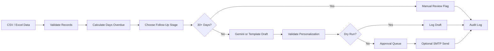

# Finance Credit Follow-Up Email Agent

An AI-assisted finance workflow that reads overdue invoice records, decides the right follow-up stage, generates personalized payment reminder emails, and logs every action for review.

The project is built to be safe for demos: emails are not sent by default. The agent runs in dry-run mode, writes sample email logs, and flags highly overdue invoices for manual finance/legal review.

## Built By

Dhruv  
IT Branch, NIT Kurukshetra  
Roll No. 123103032

## Features

- Reads invoice records from CSV or Excel.
- Calculates days overdue from the invoice due date.
- Applies a stage-wise follow-up policy.
- Generates personalized emails using Gemini when available.
- Falls back to deterministic templates if Gemini quota or API access is unavailable.
- Validates generated emails so required invoice details are not missed.
- Runs in `DRY_RUN=true` mode by default.
- Logs results to JSON, CSV, SQLite, and local trace files.
- Supports an approval queue before real email sending.
- Includes optional SMTP sending, APScheduler scheduling, Streamlit dashboard, SQLite LLM cache, and optional LangSmith tracing.

## Follow-Up Policy

| Stage | Trigger | Tone | Action |
|---|---|---|---|
| 1 | 1-7 days overdue | Warm & Friendly | Gentle reminder with payment link |
| 2 | 8-14 days overdue | Polite but Firm | Ask for payment confirmation |
| 3 | 15-21 days overdue | Formal & Serious | Ask for response within 48 hours |
| 4 | 22-30 days overdue | Stern & Urgent | Final reminder before escalation |
| 5 | 30+ days overdue | Manual Review | No auto email; assign to finance/legal review |

## Project Structure

```text
app.py
README.md
requirements.txt
.env.example
data/sample_invoices.csv
outputs/sample_email_log.json
outputs/sample_email_log.csv
src/
tests/
```

`docs/` and `prompts/` are kept local and ignored by Git. The Word project report is still available locally for form upload, but the GitHub README is complete on its own.

## Setup

```bash
python -m venv .venv
.venv\Scripts\activate
pip install -r requirements.txt
copy .env.example .env
```

Open `.env` and set at least:

```env
GEMINI_API_KEY=your_gemini_key_here
GEMINI_MODEL=gemini-2.0-flash
DRY_RUN=true
REQUIRE_APPROVAL=true
ENABLE_LOCAL_TRACING=true
LANGSMITH_TRACING=false
```

If Gemini quota is unavailable, the project still runs using template fallback emails.

## Run

```bash
python -m src.main --today 2026-05-14
```

Expected sample behavior:

```text
INV-2026-001: stage=1, status=DRY_RUN
INV-2026-002: stage=2, status=DRY_RUN
INV-2026-003: stage=3, status=DRY_RUN
INV-2026-004: stage=4, status=DRY_RUN
INV-2026-005: stage=5, status=ESCALATED
INV-2026-006: stage=0, status=SKIPPED
```

## Dashboard

```bash
streamlit run app.py
```

The dashboard lets you:

- run the agent
- filter invoices by stage/status
- review generated email bodies
- approve or reject drafts
- inspect local trace events

## Scheduling

```bash
python -m src.main --today 2026-05-14 --schedule
```

The interval is controlled by:

```env
SCHEDULER_INTERVAL_HOURS=24
```

## Data Format

Required columns:

```text
invoice_no, client_name, contact_name, contact_email, amount, currency,
due_date, follow_up_count, payment_link, account_manager_email
```

Every generated email must include:

- client name
- invoice number
- amount due
- due date
- days overdue
- payment link or contact detail

## Architecture



## Technical Decisions

- **LLM:** Gemini API, because it has a free-tier path and is enough for professional email drafting.
- **Fallback:** deterministic templates, so the demo works even if API quota is exhausted.
- **Agent workflow:** LangGraph-capable workflow, because the process maps cleanly to nodes like ingestion, escalation, generation, validation, and logging.
- **Validation:** Pydantic models for invoice records, escalation decisions, email drafts, and audit entries.
- **Storage:** JSON/CSV for readable sample outputs, SQLite for audit logs and LLM cache.
- **UI:** Streamlit for a simple review dashboard.
- **Observability:** local trace file by default, optional LangSmith for hosted tracing.

## Prompt Design

The prompt is designed to keep the LLM focused on wording only. The model does not decide invoice status, escalation stage, amount, or due date.

Prompt guardrails:

- use only validated invoice facts
- return structured JSON
- include all required personalization fields
- do not invent payment terms or client details
- match the tone selected by deterministic escalation logic

Full local prompt files are ignored by Git to avoid exposing internal prompt iterations.

## Security Mitigations

| Risk | Mitigation |
|---|---|
| Prompt injection | Validate inputs and constrain the LLM to supplied invoice facts |
| Data privacy | Use local processing and fake sample data |
| API key exposure | Keep `.env` ignored; provide `.env.example` only |
| Hallucination | Validate generated emails for required invoice fields |
| Accidental emails | Keep `DRY_RUN=true` by default |
| Unauthorized sending | Require approval before real sends |
| Email spoofing | Real sending requires verified SMTP/domain setup |
| Hosted tracing privacy | LangSmith is opt-in; local tracing is default |

## Outputs

After running the agent:

```text
outputs/sample_email_log.json
outputs/sample_email_log.csv
outputs/audit_log.sqlite
outputs/trace_events.json
outputs/approvals.json
```

## Tests

```bash
pytest
```

Tests cover:

- escalation stage boundaries
- 30+ day manual review behavior
- required email personalization checks

## Demo Flow

1. Show `data/sample_invoices.csv`.
2. Run `python -m src.main --today 2026-05-14`.
3. Open `outputs/sample_email_log.json`.
4. Show Stage 1-4 dry-run email drafts.
5. Show the 30+ day invoice marked `ESCALATED`.
6. Open the Streamlit dashboard with `streamlit run app.py`.

