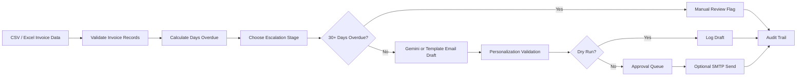

# Finance Credit Follow-Up Email Agent

AI agent prototype for generating and logging follow-up emails for overdue invoice payments. The agent reads invoice records, decides the correct follow-up stage, drafts a personalized email, and keeps an audit trail for review.

Emails are not sent by default. The project runs in dry-run mode for safe testing and demo use.

## Features

- CSV/Excel invoice ingestion
- Days-overdue calculation
- Stage-wise tone escalation
- Gemini-based email generation with template fallback
- Required-field validation for generated emails
- Dry-run email logging by default
- Manual review flag for 30+ day overdue invoices
- Approval queue before real email sending
- Optional SMTP sending
- SQLite audit log and LLM cache
- Local trace events and optional LangSmith tracing
- Optional Streamlit dashboard
- Optional scheduled runs with APScheduler

## Tech Stack

- Python
- pandas
- Pydantic
- Gemini API
- LangGraph-compatible workflow
- SQLite
- Streamlit
- APScheduler
- LangSmith optional tracing

## Technical Stack & Decision Log

**LLM:** Gemini API with `gemini-2.0-flash` as the default configurable model. Gemini was selected because it has a free-tier path and is suitable for short professional email generation. If quota is unavailable, the app falls back to deterministic templates so the demo still works.

**Agent framework:** LangGraph-compatible workflow. The workflow is structured as clear steps: ingestion, validation, overdue calculation, escalation decision, email generation, personalization validation, approval/dry-run sending, and audit logging.

**Data source:** CSV/Excel using pandas. This keeps the prototype simple and easy to test with finance-style tabular data.

**Storage:** JSON/CSV for sample outputs and SQLite for audit logs and LLM cache.

## Project Structure

```text
app.py
README.md
requirements.txt
.env.example
data/
outputs/
src/
tests/
```

## Setup

```bash
python -m venv .venv
.venv\Scripts\activate
pip install -r requirements.txt
copy .env.example .env
```

Update `.env`:

```env
GEMINI_API_KEY=your_gemini_key_here
GEMINI_MODEL=gemini-2.0-flash
DRY_RUN=true
REQUIRE_APPROVAL=true
ENABLE_LOCAL_TRACING=true
LANGSMITH_TRACING=false
```

If Gemini quota is unavailable, the app continues with template fallback emails.

## Run CLI

```bash
python -m src.main --today 2026-05-14
```

Sample output:

```text
INV-2026-001: stage=1, days_overdue=4, status=DRY_RUN
INV-2026-002: stage=2, days_overdue=11, status=DRY_RUN
INV-2026-003: stage=3, days_overdue=18, status=DRY_RUN
INV-2026-004: stage=4, days_overdue=25, status=DRY_RUN
INV-2026-005: stage=5, days_overdue=34, status=ESCALATED
INV-2026-006: stage=0, days_overdue=0, status=SKIPPED
```

## Run Dashboard

```bash
streamlit run app.py
```

The dashboard supports invoice filtering, generated email review, approval/rejection, and trace inspection.

## Run Scheduler

```bash
python -m src.main --today 2026-05-14 --schedule
```

The interval is configured with:

```env
SCHEDULER_INTERVAL_HOURS=24
```

## Input Format

Required columns:

```text
invoice_no, client_name, contact_name, contact_email, amount, currency,
due_date, follow_up_count, payment_link, account_manager_email
```

## Escalation Policy

| Stage | Trigger | Tone | Action |
|---|---|---|---|
| 1 | 1-7 days overdue | Warm & Friendly | Gentle reminder |
| 2 | 8-14 days overdue | Polite but Firm | Ask for payment confirmation |
| 3 | 15-21 days overdue | Formal & Serious | Ask for response within 48 hours |
| 4 | 22-30 days overdue | Stern & Urgent | Final reminder |
| 5 | 30+ days overdue | Manual Review | No auto email |

## Architecture



## Prompt Design

The LLM is used only for email wording. It does not decide invoice status, escalation stage, amount, due date, or payment details.

Key prompt rules:

- use only the invoice facts provided by the system
- return structured JSON with `invoice_no`, `recipient`, `subject`, `body`, `tone`, and `stage`
- include client name, invoice number, amount, due date, days overdue, and payment link
- do not invent payment terms, contact names, dates, or amounts
- match the tone selected by the escalation engine

The local `prompts/` folder is ignored by Git. This keeps working prompt iterations private while documenting the prompt approach here.

## Outputs

```text
outputs/sample_email_log.json
outputs/sample_email_log.csv
outputs/audit_log.sqlite
outputs/trace_events.json
outputs/approvals.json
```

## Security Notes

| Risk | Mitigation |
|---|---|
| Prompt injection | Validate invoice fields and constrain the LLM to supplied facts |
| Data privacy | Use local files and fake sample data for the demo |
| API key exposure | Keep `.env` ignored and commit only `.env.example` |
| Hallucination | Validate generated emails for required invoice fields |
| Accidental emails | Keep `DRY_RUN=true` by default |
| Unauthorized sending | Use approval before real sends |
| Email spoofing | Require verified SMTP/domain setup for production sending |
| Sensitive tracing | Local tracing is default; LangSmith is opt-in |

## Tests

```bash
pytest
```
