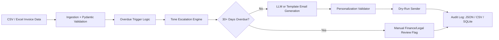

# Finance Credit Follow-Up Email Agent

An AI agent prototype for finance teams to generate payment follow-up emails for overdue invoices. The agent reads invoice records, assigns the correct escalation stage, generates personalized emails, logs every action, and flags invoices that should move to manual finance/legal review.

This repository implements **Task 2: Finance Credit Follow-Up Email Agent** from the AI Enablement Internship brief.

## Core Features

- Reads pending credit records from CSV or Excel.
- Calculates days overdue from invoice due dates.
- Applies the mandatory tone escalation matrix.
- Generates personalized emails using Gemini when configured, with a deterministic template fallback for demos.
- Uses Pydantic models to validate invoice data, escalation decisions, generated emails, and audit entries.
- Runs in `DRY_RUN=true` mode by default so no real emails are sent during testing.
- Logs every action to JSON, CSV, and SQLite.
- Stops automated emails after Stage 4 and flags 30+ day overdue invoices for manual review.
- Includes tests, sample input data, sample outputs, documentation, and an optional Streamlit dashboard.

## Escalation Matrix

| Stage | Trigger | Tone | Key Message | CTA |
|---|---|---|---|---|
| 1st Follow-Up | 1-7 days overdue | Warm & Friendly | Gentle reminder, assume oversight | Pay now link / bank details |
| 2nd Follow-Up | 8-14 days overdue | Polite but Firm | Payment still pending; request confirmation | Confirm payment date |
| 3rd Follow-Up | 15-21 days overdue | Formal & Serious | Escalating concern; mention impact | Respond within 48 hrs |
| 4th Follow-Up | 22-30 days overdue | Stern & Urgent | Final reminder before escalation | Pay immediately or call us |
| Escalation Flag | 30+ days overdue | Escalation Flag | Human review required; no auto email | Assign to finance manager |

## Project Structure

```text
finance agent/
  app.py
  README.md
  requirements.txt
  .env.example
  .gitignore
  data/sample_invoices.csv
  docs/
  outputs/
  src/
  tests/
```

The local `prompts/` folder is intentionally ignored by Git. The prompt strategy and iterations are documented in `docs/prompt_design_summary.md` without committing full private prompt files.

## Setup

```bash
cd "finance agent"
python -m venv .venv
.venv\Scripts\activate
pip install -r requirements.txt
copy .env.example .env
```

For free-tier LLM generation, add a Gemini API key to `.env`:

```env
GEMINI_API_KEY=your_gemini_api_key_here
GEMINI_MODEL=gemini-2.0-flash
DRY_RUN=true
```

If no Gemini key is configured, the app still runs end-to-end using deterministic email templates.
If your Gemini account does not support the default model, update `GEMINI_MODEL` in `.env` to a model listed for your key in Google AI Studio.

## Run The Agent

```bash
python -m src.main --today 2026-05-14
```

Outputs are written to:

- `outputs/sample_email_log.json`
- `outputs/sample_email_log.csv`
- `outputs/audit_log.sqlite`

## Run The Dashboard

```bash
streamlit run app.py
```

The dashboard shows processed invoices, dry-run email counts, escalation counts, and generated email bodies.

## Input Data Format

Required columns:

```text
invoice_no, client_name, contact_name, contact_email, amount, currency,
due_date, follow_up_count, payment_link, account_manager_email
```

Each generated email must include the client name, invoice number, amount due, due date, number of days overdue, and payment link/contact detail.

## Agent Architecture



## Technical Stack And Decision Log

See `docs/technical_stack_decision_log.md`.

## Prompt Design

See `docs/prompt_design_summary.md`.

## Security Mitigations

See `docs/security_mitigations.md`.

## Tests

```bash
pytest
```

The tests verify escalation-stage boundaries, the 30+ day escalation cap, and required email personalization checks.

## Demo Script

1. Show `data/sample_invoices.csv`.
2. Run `python -m src.main --today 2026-05-14`.
3. Open `outputs/sample_email_log.json`.
4. Show Stage 1 through Stage 4 generated dry-run emails.
5. Show the 30+ day invoice marked `ESCALATED` with no email body.
6. Optionally open the Streamlit dashboard.
