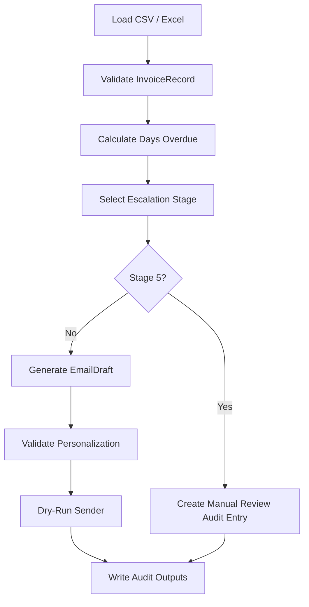

# Architecture

## Overview

The Finance Credit Follow-Up Email Agent is designed as a controlled automation pipeline. It does not let the LLM decide payment status, escalation stage, or send behavior. Those decisions are handled by deterministic code and validated data models.

## Flow

## Agent Responsibilities

- Ingestion validates source data.
- Escalation logic enforces the mandatory matrix.
- Email generation handles tone and wording.
- Validation prevents generic or incomplete emails.
- Sender ensures dry-run behavior by default.
- Audit logging records every action.

## Why This Architecture

Finance automation needs predictable behavior. A fully autonomous agent could be risky because it might over-escalate, send incorrect information, or email real clients during testing. This design uses the LLM only where it adds value: writing human-friendly emails.

